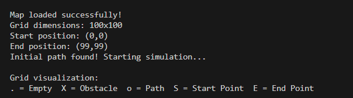
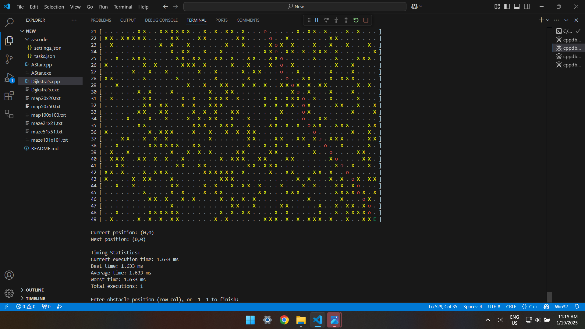

<h3>10 Jan 2025</h3>

8:00pm  
Understand the task given

8:30pm  
Watch tutorial video about Dijkstra and A* algorithm for better understandings.

9:15pm
- The plan is to use A* algorithm because it is more efficient. 
- Researching about A* algorithm code
- Try to understand and play around with it.
- [Reference](https://www.geeksforgeeks.org/a-search-algorithm/)

10:00pm  
rest

<h3>11 Jan 2025</h3>
  
8:00am  
Start to modify the code to fulfill my requirement which is:
- able to visuallise the path
- able to enter dynamic obstacle
- able to recalculate the path after dynamic obstacle is added
- able to determine the order to send parcels based on urgency and mass of the parcels.

10:00am  
requirment 1, 2 and 3 is done by:  
1. Visualization of the Grid  
`visualizeGrid` Function:  
This function is added to displays the grid with symbols representing different states:  
. : Empty cell  
X: Obstacle  
o: Path  
S: Start position  
E: Destination  
Additionally, it prints row and column numbers for easier reference during interaction.  

2. Interactive Obstacle Handling  
`handleNewObstacle` Function:  
This function is added to handle the addition of new obstacles during the simulation. It checks if the obstacle position is valid and doesn't block the current or destination points. If valid, it updates the grid with the obstacle, recalculates the path using `aStarSearch`, and attempts to find an alternative route if no valid path exists.  

3. Interactive Simulation  
`executePathWithInteraction` Function:  
This function adds an interactive step-by-step execution of the path:  
- Displays the current grid and path at each step.  
- Accepts user input to:  
    - Move to the next position.  
    - Add a new obstacle (specify coordinates).  
    - End the simulation.  

    If the user adds an obstacle, it recalculates the path using `handleNewObstacle` and adjusts the simulation accordingly.  

4. Updates to User Input Handling  
`getUserObstacle` Function:  
Handles input for obstacle coordinates, ensuring they are valid or terminate the simulation when -1 -1 is entered.  

1:00pm  
rest

<h3>13 Jan 2025</h3>

7:30pm  
Start to do the parcel order calculation part  
Added: `struct Package`,`comparePackages`,`displayShippingOrder`  
Added: `vector<Package> packages`,`sort` in main function  

8:00pm  
END!

<h3>18 Jan 2025</h3>
 
9:30pm  
- edit my code so that it reads map from txt file.
- create 3 maps and 3 maze with size 20x20, 50x50 and 100x100.
- add colours to the grid visual

12:30am  
sleep

<h3>19 Jan 2025</h3>
  
9:00am
- added current time, best time, average time, and worst time statistics.
- create another file that uses Dijkstra's algorithm  

11:00am
- start documentation

12:30pm
- DONE!

<h2>Result</h2>

<h3>1. Parcel sorting result:</h3>

It priotise urgency first, then weight.
  
<h3>2. A* algorithm map pathfinding:</h3>

Below are the results:

20x20map

50x50map

100x100map

<h3>3. A* algorithm maze pathfinding:</h3>

Below are the results:

20x20map

50x50map

100x100map

<h3>4. Dijkstra's algorithm map&maze pathfinding:</h3>

Since the output is same as the A*'s one, so I'll only put screenshot about the execution time here

20x20map

50x50map

100x100map

21x21maze

51x51maze

101x101maze

<h3>5. Time comparison between A* and Dijkstra's algorithm for map & maze pathfinding:</h3>

| Size of Map  | A* algorithm | Dijktra's algorithm |
| --------     | -------      | ------   |
| 20x20        | 0.104 ms     | 0.225 ms |
| 50x50        | 1.048 ms     | 1.613 ms |
| 100x100      | 4.906 ms     | 6.381 ms |

| Size of Maze | A* algorithm | Dijktra's algorithm |
| --------     | -------      | ------   |
| 21x21        | 0.290 ms     | 0.187 ms |
| 51x51        | 1.316 ms     | 0.958 ms |
| 101x101      | 2.538 ms     | 2.240 ms |

Map Pathfinding:

- In the case of maps, A* consistently outperforms Dijkstra's algorithm in terms of runtime across all sizes.
- This is expected since A* uses a heuristic function (Euclidean distance in this case) to guide its search toward the goal, reducing the number of nodes it evaluates.

Maze Pathfinding:

- For mazes, Dijkstra's algorithm shows better performance compared to A* for all given sizes.
- This could be because mazes typically have fewer open paths, leading to more uniform evaluation. Since A* calculates a heuristic for each step, it may introduce additional overhead, making Dijkstra's simpler approach more efficient in these constrained environments.

<h3>Conclusion:</h3>
A* is more suitable for scenarios like open maps where the heuristic can effectively narrow down the search space.
Dijkstra's works better in dense, constrained environments like mazes, where the advantage of heuristics in A* diminishes relative to its overhead.
Further experiments with different heuristic functions and optimisations in A* might provide better results.

